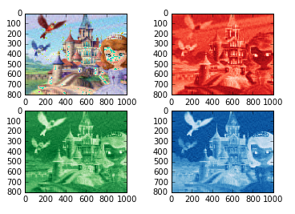
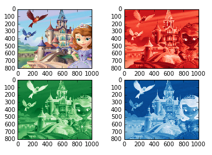

UECM3033 Assignment #2 Report
•	Prepared by: Chong Kar Yee
•	Tutorial Group: T3
________________________________________
##Task 1 -- $LU$ Factorization or SOR method
The reports, codes and supporting documents are to be uploaded to Github at:
https://github.com/chongkaryee/UECM3033_assign2.git

Explain your selection criteria here. A sparse matrix is a matrix in which most of the elements are zero in numerical analysis. 

If the matrix is sparse matrix, we will use SOR method. condition = np.count_nonzero(A) > 1/2 *len(A). 

If the nonzero element in matrix A is more than half of total elements in matrix A, it will carry out LU factorization, conversely, if the nonzero element in matrix A is less than half of total elements in matrix A, then it will perform SOR method. 

Therefore, sparse matrix is better to solve by using SOR method.

Explain how you implement your task1.py here.

There are 3 self-defined function in task1.py that is lu, sor and solve function. 

In lu function, matrix A was decomposed into LU form which is lower matrix form and upper matrix form. 

In sor function, we need a parameter called omega. If a matrix is symmetric and positive definite, omega can set to be in the range of (1 < omega < 2) that will converge for any initial vector. 

If 0 < omega <1, SOR method will have a little convergence but if omega is greater than 2 , SOR method will diverge. 

After the system matrix has been test by the condition, then it will solve by using np.linalg.solve .

##Task 2 -- SVD method and image compression

Put here your picture file (nana.png)

  
  
How many non zero element in $\Sigma$?
There are 800 non zero elements for the red, green and blue.

Put here your lower and better resolution pictures. 
Lower resolution picture

 
 

Better resolution picture

Explain how you generate these pictures from task2.py.
Firstly, the “nana.png” image which we read is assigned to img and then generate array into r,g,b matrix. By using sp.linalg.svd decomposition, each r,g,b matrix is decomposed into U, S and V matrix. Then, number of non-zero elements in Sigma for r,g,b is counted respectively. A new Sigma matrix is created by keep the first n non zero element and change the other non zero element to zero by zero_like function. In order to construct a lower resolution matrix, the dimension of Sigma is changed to 30 by using indexing function like [0:30]. Then a better resolution image is also created by changing the resolution of the picture to 200 by repeating the same steps. 

What is a sparse matrix?
A sparse matrix is a matrix in which most of the elements are zero. Sparse matrix is a good too to allow picture compress into low resolution picture more easily. This is because when we compress the picture, the matrix will have more zero and so it can be stored in sparse matrix. Sparse matrix only require less storage and so it is easy to compress. 

last modified: 11/3/2016
